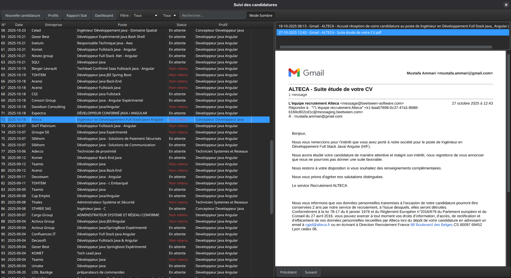
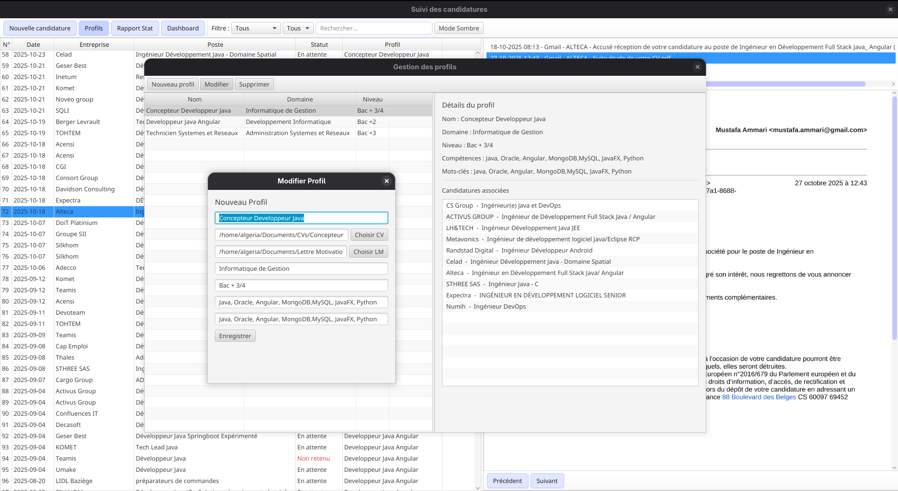

# Suivi Candidatures


Application JavaFX pour **suivre l'avancement de candidatures professionnelles**.  
Permet de gérer vos profils, candidatures, documents et d’avoir une vue claire sur l’état de chaque candidature.

---

## Fonctionnalités

| Fonctionnalité                       | Description                                              |
|-------------------------------------|----------------------------------------------------------|
| Gestion profils                      | Création, modification et suppression des profils       |
| Suivi des candidatures               | Statuts des candidatures, historique et notes           |
| Documents associés                   | Import/export PDF ou fichiers liés aux candidatures     |
| Interface graphique                  | JavaFX avec thèmes clair/sombre                          |
| Base de données                      | Persistance via SQLite et scripts de migration          |
| Tests et validation                  | Tests unitaires pour la logique métier                  |

---

## Architecture du projet

```
                 ┌───────────────────┐
                 │   Application     │
                 └─────────┬─────────┘
                           │
                   ┌───────┴────────┐
                   │    Controller   │
                   │ (JavaFX Views)  │
                   └───────┬────────┘
                           │
              ┌────────────┴─────────────┐
              │          Service          │
              │ (Logique métier & DAO)    │
              └────────────┬─────────────┘
                           │
                     ┌─────┴─────┐
                     │  Persistence │
                     │ (SQLite DB) │
                     └─────────────┘
```

---

## Structure du projet

```
suivi-candidatures/
├── src/main/java/app/          # Code source principal
│   ├── controller/            # Contrôleurs JavaFX
│   ├── model/                 # Modèles de données
│   ├── persistence/           # Gestion de la base de données
│   ├── service/               # Services métiers
│   └── divers/                # Scripts utilitaires et migrations
├── src/main/resources/app/    # Fichiers FXML
├── src/main/resources/sql/    # Scripts SQL
├── src/main/resources/styles/ # Thèmes CSS
├── pom.xml                     # Maven
└── README.md                   # Documentation
```

---

## Installation & Lancement

1. **Cloner le dépôt :**

```bash
git clone https://github.com/mustafa-ammari/suivi-candidatures.git
cd suivi-candidatures
```

2. **Build Maven :**

```bash
mvn clean install
```

3. **Lancer l'application :**

```bash
mvn javafx:run
```

---

## Technologies utilisées

- **Java 17**  
- **JavaFX** pour l’interface graphique  
- **Maven** pour la gestion du projet  
- **SQLite** pour la persistance  
- Structure **MVC** pour une maintenance facile  

---

## Contribution

1. Créez une branche pour votre fonctionnalité :  

```bash
git checkout -b feature/ma-fonctionnalite
```

2. Commitez vos changements :

```bash
git commit -m "Ajout de la fonctionnalité X"
```

3. Poussez sur GitHub et ouvrez une Pull Request.

---

## Auteur

Mustafa Ammari  
[GitHub](https://github.com/mustafa-ammari)  

---

## Capture d’écran (optionnel)

## Capture d’écran

### Vue principale


### Formulaire profil


### Thème sombre

